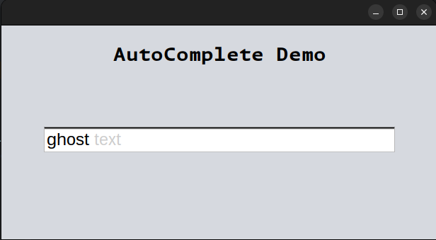
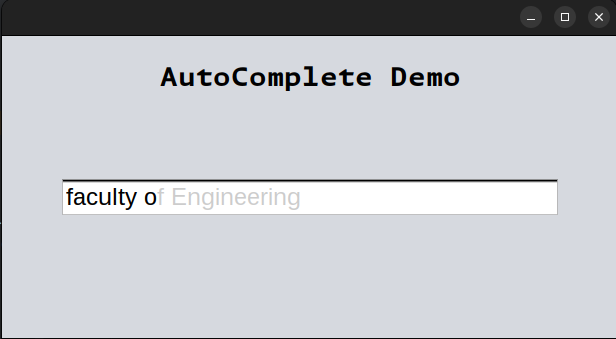

# AutoComplete

Originally assigned to my class as a project by our **Data Structures and Algorithms** professor in my 5th semester of BSCS,
this became more of a personal project for me. The original project was just a CLI app where users can input a word or letter and the script offers autocomplete options based on the words provided in a text file.

I decided why not turn it into a GUI. The hardest part was figuring out how to do the *"Ghost  Text"* effect in the text input field.
After quite a bit of brainstorming i came up with the idea to stack two input fields on top of each other and disable the one below and set its text color to a dim gray.
And then simply use a document listener to check for changes in the top input field and suggest the changes in the one below.

This does come with a few caveats such as the fact that the text field auto scrolls to the left when the text length grows beyond the field's width. But i think it's a small price to pay for the effect.

Here are a few visuals:

This is my first java project that I published on github so I'm not entirely sure hwo to have general instructions to run it but if you open the project in any Java IDE, it should let you run one of AutoCompleteGUI, AutoCompleteCLI or AutoComplete files as the main file as all three have a main method.